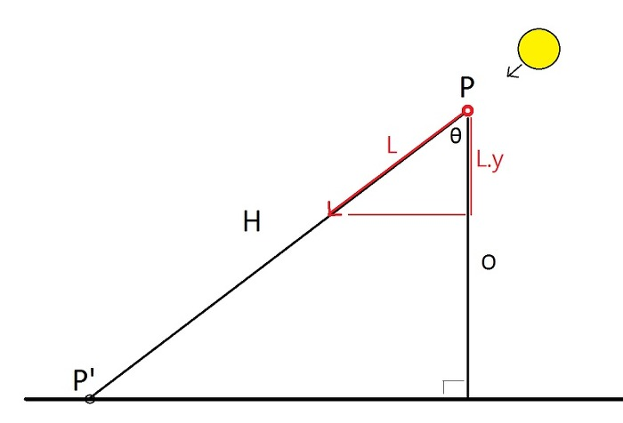

# PlanarShadowInURP
an implementation of planar shadow in unity URP pipeline , also render shadow to a render texture!

according to this article : https://ozlael.tistory.com/10




```
float4 vPosWorld = mul( _Object2World, v.vertex);
float4 lightDirection = -normalize(_WorldSpaceLightPos0); 
float opposite = vPosWorld.y - _PlaneHeight;
float cosTheta = -lightDirection.y;	// = lightDirection dot (0,-1,0)
float hypotenuse = opposite / cosTheta;
float3 vPos = vPosWorld.xyz + ( lightDirection * hypotenuse );
o.pos = mul (UNITY_MATRIX_VP, float4(vPos.x, _PlaneHeight, vPos.z ,1));

```
